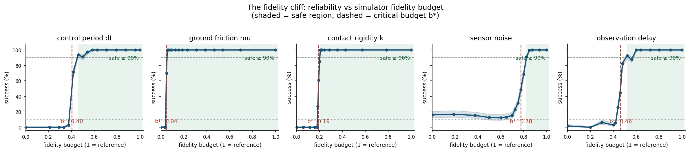
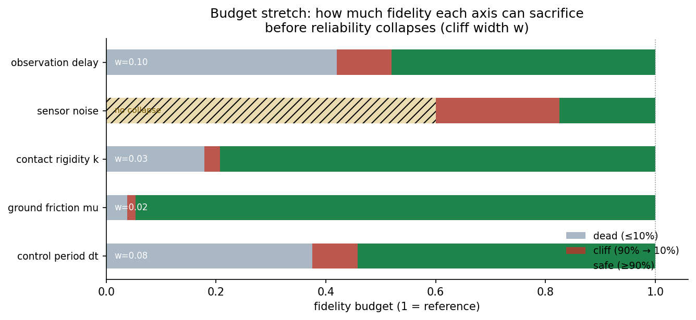
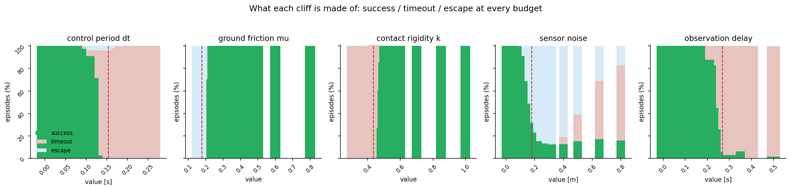

# SimLeap: How Much Simulator Fidelity Can You Give Up Before the Policy Stops Transferring?

*Fidelity budgets and their cliffs for a contact-rich manipulation policy*

**Subject:** sim-to-real-style transfer of a fixed-gain manipulation policy across
degraded simulators
**Method:** a deterministic 2D pushing task, one policy calibrated at reference
fidelity, five physical knobs swept one at a time over 84 budget cells × 300 seeds
**Main result:** four of five fidelity budgets collapse at a critical point; only
sensor noise degrades gracefully — and the failure mode names the likely broken knob

---

## Abstract

Real2Sim2Real loops assume the simulator is a faithful stand-in for reality — but
only up to a point. That point, the *fidelity budget* at which a calibrated policy
stops transferring, is almost never measured. We build a deterministic 2D pushing
task, calibrate a PD push policy once in a reference (high-fidelity) simulator,
then replay it — unchanged — as five physical knobs are degraded one at a time:
the control period `dt`, ground friction `mu`, contact rigidity `k`, sensor noise,
and observation delay.

Three observed trends, each precise enough to guide deployment choices:

1. **Amplitude vs phase.** The two knobs that corrupt the same observation
   channel produce opposite cliff shapes. Sensor noise (an *amplitude*
   perturbation) degrades reliability gracefully over a wide budget range and
   never fully kills it — a ~12–17% floor survives total budget exhaustion. Sensor
   delay (a *phase* perturbation on the feedback loop) collapses reliability at a
   critical point, the way time delay destroys phase margin in classical control.
2. **Dynamics knobs are critical-point failures.** Control period, friction and
   contact rigidity all hold ≥90% reliability until a physical threshold, then
   collapse to <10% — but the transition widths differ: `mu` 0.015, `k` 0.028,
   `dt` 0.083 budget units. Only `mu` and `k` collapse within a few percent of
   budget; `dt` and `delay` erode through several grid points first. Friction is
   the sharpest cliff of all: across the 0.01 window `mu` 0.185 → 0.175,
   reliability goes from 100% to 0%, through an intermediate 70% at `mu = 0.18`.
3. **Failure modes are diagnostic.** The dominant failure mode identifies the
   mechanism class. *Escape* (the block is lost off-workspace) means a loss of
   control authority — friction can no longer stop the block, or the observed
   goal is offset. *Timeout* (the push never finishes) means a loss of
   responsiveness — the actuator, the contact, or the feedback loop is too slow
   to complete the task in time.

## 1. Motivation

Every simulation budget is a negotiation: cheaper simulators run faster, but a
policy that works in the simulator stops working when the sim stops being a
faithful stand-in. Where exactly is the boundary? A contact-rich pushing task is
the sharpest possible probe, because the whole policy rests on a handful of
physical quantities — how fast the actuator responds, how much friction the ground
provides, how rigid the contact is — that the simulator controls directly.

The question is not hypothetical. The DISCOVERSE family of simulators — built
for Real2Sim2Real robot learning, from the 3DGS-based DISCOVERSE platform [4] to
the high-throughput GS-Playground with its parallel physics engine and batch
Gaussian-Splatting renderer [5] — makes the promise that a policy trained in a
photorealistic digital twin transfers to the real robot with zero fine-tuning.
What neither paper measures is the *safety margin* of that promise: both
simulators present fidelity as a monolithic property that is uniformly high, and
report a single aggregate Sim2Real success rate. A deployment engineer who has
to decide *where* to spend the next compute cycle — on a smaller control period,
better ground friction, stiffer contacts, cleaner sensors, or lower latency — is
given no budget table. The Real2Sim pipeline behind these platforms reconstructs
every part of the scene with equal effort, on the implicit assumption that all
fidelity is equally valuable.

We challenge that assumption. We answer a quantitative question: **for each
fidelity knob, what is the smallest budget that keeps transfer reliability above
90%, and what happens just below it?** The result is a budget table that the
DISCOVERSE-class of Real2Sim2Real loops can spend against: which knobs must be
held at reference fidelity, which tolerate aggressive degradation, and which
announce their failure through a diagnosable failure mode.

## 2. Task design

A circular pusher (radius 0.35 m) drives a block (radius 0.25 m) from a jittered
start position toward a goal 4 m away. The goal is a disc of radius 0.18 m; the
episode must finish within 15 s. Success means the block *enters* the goal and
*comes to rest* (speed below 0.05 m/s); failure is either a *timeout* (15 s
elapsed) or an *escape* (the block leaves the ±6 m workspace).

Physics advances on a fixed 2 ms substep. We deliberately use a quasi-static,
analytic contact model instead of a full rigid-body engine [1, 2, 3]: the
reduction guarantees that a change in one fidelity knob cannot bleed into the
others, that every episode is byte-deterministic, and that the *interpretation*
of each cliff stays unambiguous. Each knob has a clean, interpretable effect:

- **Control period `dt`.** The policy re-decides every `dt` seconds while physics
  steps at 2 ms. The actuator is a critically-damped second-order system whose
  bandwidth equals the control rate `1/dt`: a coarse control period simply cannot
  execute high-frequency commands, and the pusher acts with progressively staler,
  more sluggish authority.
- **Ground friction `mu`.** The block decelerates at `mu·g` once sliding; a low
  coefficient lets it coast through the goal instead of stopping.
- **Contact rigidity `k`.** The block absorbs a fraction `k` of the pusher's push
  velocity (1 = rigid, ≪1 = soggy contact). A soft contact also lets the block
  *skid* sideways off the push line.
- **Sensor noise.** A fixed per-episode perturbation trajectory is scaled by the
  noise budget and added to the policy's observations of pusher and block.
- **Observation delay.** The policy sees the state as it was `delay` seconds ago.

## 3. The policy and the transfer protocol

The policy is a PD position controller (positional gain 80, damping 15, acceleration
limit 60 m/s²) that aims at a point 0.30 m behind the block, along the direction
from block to goal, and brakes hard (gain 40) once the block is inside the goal.
Gains are calibrated *once* at the reference configuration and frozen; every
degraded run replays the identical controller. Degradation is entirely a property
of the simulator, never of the policy — but note that this is a *within-simulator*
transfer protocol. No real-hardware transfer was measured: the sweep replays one
policy across simulators of decreasing fidelity, which isolates the component a
Real2Sim2Real loop controls, without claiming the real-robot step was run.

The sweep varies one knob at a time over a grid of 16–18 values spanning the
reference value down to a fully degraded one (84 cells in total), running 300
deterministic seeds per cell (25,200 episodes, minutes on a laptop). Each grid
point is normalised to a **fidelity budget** `b ∈ [0, 1]`, where `b = 1` is the
reference simulator and `b = 0` is the most degraded configuration sampled.

## 4. Results

Every axis starts at 100% reliability and degrades monotonically at the level of
its Wilson intervals — a handful of grid points carry small non-monotone bumps of
≤1–3 percentage points, well inside the 300-seed sampling noise (see
`check.py`). The summary:

| Axis | Critical budget b\* | Critical value | Safe (≥90%) | Collapse (≤10%) | Width | Dominant failure |
|---|---|---|---|---|---|---|
| Friction `mu` | 0.044 | 0.179 | b ≥ 0.054 (`mu ≥ 0.185`) | b ≤ 0.038 (`mu ≤ 0.175`) | **0.015** | escape |
| Contact rigidity `k` | 0.191 | 0.433 | b ≥ 0.207 (`k ≥ 0.445`) | b ≤ 0.179 (`k ≤ 0.425`) | **0.028** | timeout |
| Control period `dt` | 0.404 | 0.153 s | b ≥ 0.458 (`dt ≤ 0.14 s`) | b ≤ 0.375 (`dt ≥ 0.16 s`) | **0.083** | timeout |
| Observation delay | 0.463 | 0.269 s | b ≥ 0.520 (`delay ≤ 0.24 s`) | b ≤ 0.420 (`delay ≥ 0.29 s`) | **0.100** | timeout |
| Sensor noise | 0.777 | 0.179 m | b ≥ 0.825 (`noise ≤ 0.14 m`) | *never* (floor 12–17%) | — | escape → timeout |

### 4.1 Amplitude vs phase: noise is graceful, delay is critical

The two knobs on the same observation channel behave completely differently.
Sensor noise is the *only* graceful axis: reliability erodes continuously from
100% at `noise = 0` to ~70% at 0.16 m, crosses 50% at `noise ≈ 0.18 m` — the
same order as the 0.18 m goal radius — and then settles on a floor of 12–17%
that survives even total budget exhaustion. Noise perturbs the *amplitude* of
the observation; the feedback loop stays stable and the policy still converges,
just to a noisier, worse point.

Observation delay is the opposite. Reliability stays at 100% through
`delay = 0.20 s`, dips to 88% at 0.22 s, then collapses: 83% at 0.26 s, 45% at
0.27 s, 26% at 0.28 s, 6% at 0.29 s. (The small recovery at 0.24 s, 93%, is
within the axis's Wilson-interval noise.) Delay perturbs the *phase* of the
feedback loop, and phase lag has a hard stability boundary — the classical delay
margin. An amplitude perturbation degrades you continuously; a phase
perturbation breaks the loop at a threshold.

### 4.2 Dynamics knobs: calibrated policies live in a narrow neighbourhood

Friction, contact rigidity and control period all produce the same pattern:
reliability sits at 100% across a large range, then falls off a cliff in a few
steps of the grid.

Friction is the sharpest. The block decelerates at `mu·g`, so the braking
requirement — stop the block inside the 0.18 m goal — sets a threshold. Above
`mu = 0.185` reliability is 100%; at `mu = 0.18` it has already dropped to 70%;
below `mu = 0.175` it is 0%. The bulk of the transition happens across
`Δmu = 0.01`. The dominant failure at the cliff is *escape*: the block coasts
through the goal, never stops, and slides off the workspace. This is a pure loss
of control authority.

Contact rigidity collapses at `k ≈ 0.43`: below it, the block moves at less than
half the push speed, the push crawls, and every episode ends in timeout. The
control-period cliff sits at `dt ≈ 0.15 s` — an actuator bandwidth of ~6.5 Hz,
below which the critically-damped actuator cannot track the PD commands fast
enough to finish the push; failures are again timeout.

### 4.3 Failure modes: naming the likely broken knob

The failure-mode decomposition (success / timeout / escape at every grid point)
makes the mechanism legible. Escape is caused by friction and, at the noise cliff,
by the observed goal being offset — the policy pushes the block past the goal.
Timeout is caused by `dt`, `k` and `delay` — the push is too slow to finish, the
contact transmits too little force, or the loop acts on a state too old to brake
in time. Given a simulator that reports low reliability, the failure mode narrows
the fault to a class of knob: *escape* rules out the control/contact/latency
class and points to friction or a mis-calibrated goal observation; *timeout*
points to the control loop. The mode is diagnostic within these classes — it
does not fingerprint a single knob.

## 5. Related Work

**Real2Sim2Real simulation platforms.** The direct context for this study is the
line of work from the DISCOVER Lab at Tsinghua AIR. DISCOVERSE [4] is a modular,
open-source simulation framework that reconstructs photorealistic digital twins
of real scenes with 3D Gaussian Splatting and simulates them with MuJoCo,
demonstrating state-of-the-art zero-shot Sim2Real transfer for imitation-learned
policies. Its successor GS-Playground [5] couples a custom parallel physics
engine (velocity-impulse, constraint-island parallelization) with a batch 3DGS
renderer to reach ~10⁴ FPS across 2,048 parallel environments on a single GPU,
and adds an automated Real2Sim pipeline that turns a single RGB image into a
simulation-ready digital twin in minutes. Both systems report aggregate transfer
success; neither reports how that success degrades as individual fidelity knobs
are relaxed. Our sweep is the missing budget table for this class of loop.

**Domain randomization and simulation tuning.** The standard answer to
simulator gap is to randomize the simulator rather than measure it. Tobin et al.
[6] randomize object textures, shapes and lighting to make policies robust
across simulators; Bousmalis et al. [7] combine simulation with domain
adaptation for grasping; more recent work randomizes physics parameters
(contact, friction) explicitly [8]. Domain randomization asks *how broad a
distribution the policy can survive*; we ask the complementary question *how
much single-axis fidelity a fixed policy needs*. The two are orthogonal: a
policy trained under randomization still lives inside the simulator's physical
model, and that model's fidelity envelope is exactly what we map.

**Simulator accuracy studies.** Comparisons of physics engines and integration
schemes [9, 10] measure error in the simulator's own coordinates (trajectory
RMSE, contact error) rather than in the downstream quantity an engineer cares
about — whether a trained policy still transfers. Our work measures the policy
outcome directly, which is the metric that determines deployment decisions.

## 6. Discussion

Three design rules for anyone spending a simulation budget:

1. **Treat noise as the free budget.** You can discard ~18% of the noise budget
   before reliability drops below 90%, and even total noise only costs you to a
   ~15% floor. Noise is the knob to economise on when a simulator needs to be
   cheap.
2. **Never cross a dynamics threshold on faith.** Friction, rigidity and control
   period are forgiving up to a razor-thin edge — `mu` tolerates degradation down
   to 23% of its reference value, then fails across a 0.01 step. A simulator that
   is "close to" the reference on these axes must be *verified*, not assumed:
   the safe region and the cliff sit adjacent to each other.
3. **Read the failure mode.** Escape means the block cannot be stopped (fix
   friction); timeout means the push cannot finish (fix control rate, contact
   rigidity, or feedback latency). The reliability curve tells you *where* you
   are; the failure mode tells you *which knob* to repair.

The cliff shapes also validate the quasi-static model itself: the five axes
degrade monotonically to within sampling noise, the reference simulator transfers
perfectly, and the brittle/critical axes collapse cleanly at physically meaningful
thresholds — friction at the brake limit, rigidity at half the push speed, delay
at the loop's phase margin, noise at the scale of the goal itself.

## 7. Reproducibility

- **Simulator:** deterministic 2D pushing, 2 ms substep, quasi-static analytic
  contact, critically-damped second-order actuator for `dt`; noise uses a fixed
  per-episode perturbation scaled by the budget (see `src/simleap/sim.py`)
- **Policy:** fixed PD position controller with standoff and brake, calibrated
  once (see `src/simleap/policy.py`)
- **Sweep:** 5 axes × 16–18 grid points = 84 cells × 300 seeds = 25,200 episodes
- **Data:** `results/sweep.json`; verify with `python -m simleap.check`, extract
  claims with `scripts/paper_facts.py`, figures with `scripts/render_figures.py`
- **Cost:** pure-Python; the full sweep runs in minutes on a laptop

## References

1. Todorov E., Erez T., Tassa Y. MuJoCo: A Physics Engine for Model-Based
   Control. *IROS 2012*.
2. Zhu Y., Wong J., Mandlekar A., et al. robosuite: A Modular Simulation
   Framework and Benchmark for Robot Learning. *arXiv:2009.12293*, 2020.
3. Makoviychuk V., Wawrzyniak L., Guo Y., et al. Isaac Gym: High Performance
   GPU-Based Physics Simulation for Robot Learning. *NeurIPS 2021 Datasets and
   Benchmarks*.
4. Jia Y., Wang G., Dong Y., et al. DISCOVERSE: Efficient Robot Simulation in
   Complex High-Fidelity Environments. *IROS 2025*, arXiv:2507.21981.
5. Jia Y., Zhang H., Zhang Z., et al. GS-Playground: A High-Throughput
   Photorealistic Simulator for Vision-Informed Robot Learning. *RSS 2026*,
   arXiv:2604.25459.
6. Tobin J., Fong R., Ray A., et al. Domain Randomization for Transferring Deep
   Neural Networks from Simulation to the Real World. *IROS 2017*.
7. Bousmalis K., Irpan A., Wohlhart P., et al. Using Simulation and Domain
   Adaptation to Improve Efficiency of Deep Robotic Grasping. *ICRA 2018*.
8. Andrychowicz M., Baker B., Chociej M., et al. Learning Dexterous In-Hand
   Manipulation. *IJRR 2020*.
9. Erez T., Tassa Y., Todorov E. Simulation Tools for Model-Based Robotics:
   Comparison of Bullet, Havok, MuJoCo, ODE and PhysX. *ICRA 2015*.
10. Hwangbo J., Lee J., Hutter M. Per-Contact Iteration Method for Solving
    Contact Dynamics. *IEEE RA-L 2018*.
