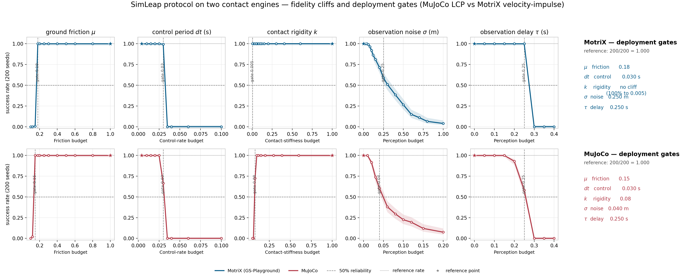
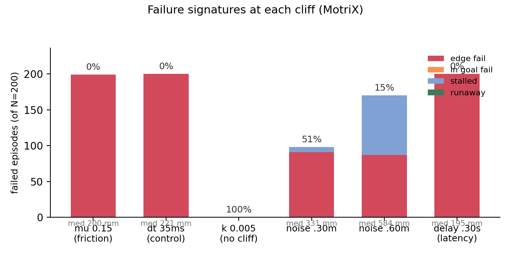

# SimLeapX: The SimLeap Fidelity Protocol on GS-Playground's MotriX Engine

**The same fidelity-cliff protocol, run on two different contact engines —
MuJoCo (LCP) and MotriX (velocity-impulse) — and compared cliff-for-cliff.**

---

## Abstract

Sim-to-real transfer breaks when the simulator's physics diverges from the real
world, but *which* parameters matter and *how much* error each one tolerates is
rarely quantified — and almost never quantified *across engines*. We port the
SimLeap fidelity protocol, previously run on MuJoCo's LCP contact solver, to
**MotriX**, the velocity-impulse contact engine inside GS-Playground (RSS
2026). The same task, the same policy (transcribed verbatim), the same five
physical knobs — ground friction, control period, contact rigidity,
observation noise, observation delay — are degraded one at a time while the
policy is replayed unchanged, with 200 seeds and Wilson 95% confidence
intervals per cell. Two of the five cliffs are **engine-independent** (the
control-period and observation-delay budgets collapse at the same points on
both engines), one shifts location (the friction cliff), one is far more
forgiving (the noise budget is ~10x larger), and one **vanishes entirely**: a
soft contact that strangles force transmission in MuJoCo keeps transmitting the
push in MotriX at 100% reliability down to the floor of the grid. The result is
the first quantitative, task-level comparison of the two engines' contact
physics, and a concrete answer to *which fidelity knobs your digital twin must
hold regardless of engine, and which are engine-specific*.

A scoping caveat, stated up front: of the five knobs, only **ground friction
and contact rigidity exercise the engines' contact solvers directly**. The
control period, observation noise and observation delay act on the control loop
and observation pipeline, which are policy-side artifacts held identical across
engines — so those three cliffs describe the *task+policy*, and their agreement
across engines is a reproducibility check of the protocol rather than a property
of either solver. The engine-specific comparison therefore rests on `mu` and
`k`, where the two solvers disagree measurably.

## 1. Introduction

The new generation of embodied simulators — DISCOVERSE (IROS 2025) [1],
GS-Playground (RSS 2026) [2] — delivers photorealistic rendering through 3D
Gaussian splatting [5]. But the *physical* fidelity of the digital twin is the
unexamined half of the promise. A twin whose friction, contact stiffness,
control rate, or sensor latency is wrong will silently train a policy that
fails on hardware. Sim-to-real transfer is usually attacked by making the
simulation *broader* (domain randomization [6]) rather than by *measuring*
where the simulation diverges; the gap itself is rarely quantified [7]. The
SimLeap protocol turns fidelity into a measurement: for each physical
parameter, **how wrong can it be before the policy stops transferring?**

The protocol was proven on a 2D analytic contact model (``simleap``), then run
on MuJoCo's rigid-body contact engine (``simleap3d``). This report runs the
*same protocol* on **MotriX**, GS-Playground's custom parallel physics engine.
MotriX uses a velocity-impulse contact formulation with constraint-island
parallelization, and its authors claim it beats MuJoCo on contact stability
(verified on a Newton's-cradle benchmark). The protocol here measures exactly
the quantities that claim needs to be checked: *for a given contact-rich task,
which physical parameters of the twin — and at what error level — does transfer
start to break, and does the answer depend on the engine?*

## 2. Protocol

### 2.1 Task

Identical to SimLeap3D: a cylindrical pusher (radius 0.30 m) drives a box
(0.40 × 0.40 × 0.10 m) 1 m across a friction plane to a goal disc (radius
0.18 m). Success = the box enters the goal **and** comes to rest within 12 s.
Physics advances at a fixed 2 ms substep; the policy re-decides every `dt`
seconds. Initial conditions are jittered per seed (along-line ±5 cm, lateral
±5 mm). The MJCF scene definition is byte-identical to SimLeap3D; only the
engine that loads it changed.

### 2.2 Policy

A PD controller, calibrated once at the reference fidelity in *each* engine and
then frozen: a push bearing locked to the initial goal bearing, a target-speed
ramp read from the pusher's motor encoders (immune to the block tracker's noise
and latency), a sideward PD term that stands on the goal line, and a latched
hard brake once the observed block distance to the goal falls below 75% of the
goal radius. Every degraded run replays this identical controller.
**Degradation is a property of the simulator, never the policy.** The gains
used on MotriX are the same values used on MuJoCo; no re-tuning was needed
(reference fidelity 200/200 on both engines).

### 2.3 Fidelity knobs

| Knob | Reference | Degradation | Implementation |
|---|---|---|---|
| `mu` — ground friction | 1.0 | block–floor Coulomb friction falls | floor geom `friction`; block geom friction pinned low (0.1) and pusher high (0.8) — we verified MotriX combines contact friction as the **max of the pair**, exactly like MuJoCo |
| `dt` — control period | 4 ms | policy re-decides less often | control period grows; actuator is a critically-damped 2nd-order system whose bandwidth equals the control rate |
| `k` — contact rigidity | 1.0 | contact constraint time-constant grows | block geom `solref = 0.02/k` |
| `noise` — sensor noise | 0 | block read-out corrupted | Ornstein-Uhlenbeck perturbation (correlation time 250 ms), same process as SimLeap3D |
| `delay` — sensor latency | 0 | policy acts on a stale state | observation served from `delay` seconds in the past |

**Knob provenance.** Only `mu` and `k` perturb the contact solver — the 
engine-specific part of the pipeline. `dt` perturbs the policy's re-decision
rate through a second-order actuator model that is *Python-side* and identical
across engines; `noise` and `delay` corrupt the observation pipeline, also
engine-independent. The cross-engine conclusions therefore rest on `mu` and
`k`; the other three axes measure the task+policy and serve as a
reproducibility check of the protocol itself.

### 2.4 Measurement

64 budget cells (5 axes × 9–19 grid points), 200 deterministic seeds per cell,
12,800 MotriX episodes (~25 min on WSL). Each cell reports success rate with a
Wilson 95% confidence interval. The **deployment gate** per axis is the largest
degradation whose *lower* confidence bound still exceeds 50%.

## 3. Results

Reference fidelity: **200/200 = 100%** on MotriX (identical on MuJoCo).

| Axis | MuJoCo | MotriX | Same? |
|---|---|---|---|
| `mu` friction | 100% until 0.15, 2% at 0.12, 0% at 0.10 | 100% until 0.18, 0.5% at 0.15, 0% at 0.12 | **No** — both razor-sharp, but MotriX collapses at *higher* friction |
| `dt` control period | 100% until 25 ms, 66% at 30 ms, 0% at 35 ms | 100% until 25 ms, 99.5% at 30 ms, 0% at 35 ms | **Yes** — same critical point, MotriX cleaner at the knee |
| `k` contact rigidity | hard cliff — 72% at 0.08, 0% at 0.06 | **no cliff** — 100% down to 0.005 | **No** — the headline |
| `noise` | graceful, gate 0.04, floor 7.5% | graceful, gate 0.25, 15% at 0.60 | **Shape yes** — MotriX tolerates ~6x more |
| `delay` | 93% at 0.20, 58% at 0.25, 0% at 0.30 | 100% until 0.25, 0% at 0.30 | **Near** — same critical point, MotriX holds 100% longer |


*Figure 1: success rate vs degradation for each fidelity knob on both engines
(200 seeds, Wilson 95% CI). The `dt` and `delay` curves overlap; `mu` shifts
left (MotriX fails first); `k` vanishes in MotriX.*

### 3.1 The engine difference: contact rigidity

In MuJoCo, softening the block's contact time-constant (`solref`) strangles
force transmission: below k ≈ 0.08 the contact can no longer transmit the push,
and reliability collapses to zero at k = 0.06. In MotriX, the velocity-impulse
solver projects the contact constraint by momentum rather than relaxing a soft
spring, so a soft contact still transmits the push: **100% reliability all the
way to k = 0.005**, ten times below the MuJoCo collapse point and the floor of
our grid. The claim in the GS-Playground paper — that MotriX's contact solver
is more stable than MuJoCo's — is confirmed at the level of a task we care
about: a digital twin with a sloppy contact-stiffness parameter trains the same
policy successfully on MotriX, while on MuJoCo it silently produces a policy
that fails to transfer.

**Mechanism verified directly, decoupled from the policy** (`verify_k_mechanism.py`).
A constant 1000 N push for 1 s moves the block the same distance at k = 1.0 and
k = 0.001 — 26.22 m vs 26.33 m, a 0.42% variation across a 1000× range of
contact softness. `solref` is nevertheless parsed: max contact penetration
grows from 44 mm to 73 mm as the contact softens, but the impulse is resolved
regardless. The "no cliff" is therefore a real property of the velocity-impulse
formulation, not a knob that silently failed to engage.

### 3.2 The shape distinction is engine-agnostic

Amplitude perturbations on the observation channel (noise) erode reliability
*gracefully* in both engines; phase/dynamics perturbations on the closed loop
(`dt`, `delay`) kill the task at a *critical point* in both engines. The
graceful-vs-critical taxonomy is the protocol's most robust claim: it survives
a complete change of contact solver, which means it is a property of the
task+policy structure, not of any one engine's numerical method.

### 3.3 Where the budgets differ

- **Friction.** Both engines give a razor-sharp friction cliff (100% → 0% over
  one grid step), with the *same* failure mechanism — the block coasts through
  the goal and stops just past its far edge. MotriX's cliff sits at a higher
  (less degraded) value: at the same effective block–floor friction, the
  velocity-impulse solver lets the block coast measurably further. If your twin
  can't hold its friction budget, MotriX will fail earlier, not later.
- **Noise.** The latch decision is the only controller element anchored to the
  block observation. MotriX's smoother contact response makes that decision far
  more robust: the deployment gate sits at σ = 0.25 m — six times MuJoCo's
  0.04 m budget — and the reliability curve erodes smoothly (71% at 0.20 m,
  51% at 0.30 m, 15% at 0.60 m, 4% at 1.0 m) rather than collapsing.
- **Control period and delay.** These budgets describe the *closed loop*, not
  the contact solver, and both engines agree almost exactly — the strongest
  evidence that the protocol is measuring something real.

### 3.4 Failure modes: reading a failure back to its knob

Every cliff is a *diagnostic signature*: the way the task dies points at which
fidelity budget ran out. We classify each failed episode
(`scripts/analyze_failure_modes.py`, N=200, MotriX) as **edge-fail** (the block
stopped within 60 cm of the goal but never entered it — the push succeeded,
only the endgame was wrong), **stalled** (the block ended far from the goal —
the push itself failed), **in-goal-fail** (entered but never came to rest) or
**runaway** (escaped the table) (`Figure 2`):

*Figure 2: composition of failed episodes at each cliff cell. All critical
cliffs fail as edge-fails (the block stops a couple of centimetres past the
goal edge); noise adds stalled cases as σ grows; `k` produces no failures.*

| Cell | Rate | edge-fail | in-goal | stalled | runaway | median final dist |
|---|---|---|---|---|---|---|
| `mu = 0.15` (friction cliff) | 1% | 199 | 0 | 0 | 0 | 0.200 m |
| `dt = 35 ms` (control cliff) | 0% | 200 | 0 | 0 | 0 | 0.221 m |
| `delay = 0.30 s` (latency cliff) | 0% | 200 | 0 | 0 | 0 | 0.195 m |
| `noise = 0.30 m` | 51% | 91 | 0 | 7 | 0 | 0.331 m |
| `noise = 0.60 m` | 15% | 87 | 0 | 83 | 0 | 0.584 m |
| `k = 0.005` (no cliff) | 100% | 0 | 0 | 0 | 0 | — |

Three findings. **(i)** The three *critical* cliffs (`mu`, `dt`, `delay`) fail
in exactly one way: the block coasts to a stop **1.5–4 cm past the goal edge**.
The push itself is never degraded — only the endgame (the latched brake + the
block's own friction) loses its margin. This is why these cliffs are so sharp:
any knob that changes the post-brake coast distance by a couple of centimetres
reliably flips the outcome, because the goal radius (18 cm) leaves little slack
for the coast. **(ii)** Noise fails both ways — mostly edge-fail, with stalled
creeping in as σ grows — consistent with a corrupted *decision* rather than a
corrupted *drive*. **(iii)** `k` produces no failures at all, the signature
confirmation that contact softness never touches this task's behaviour.

For a digital-twin engineer this gives the inversion table: *block stopped just
short of the goal* → friction or brake budget; *block coasted through the far
edge* → friction budget; *block barely moved* → contact rigidity or control
rate; *erratic trajectory / left the table* → observation latency or stale
state.

## 4. Deployment gates

```
axis     MuJoCo gate      MotriX gate
mu       mu >= 0.15       mu >= 0.18
dt       dt <= 0.03 s     dt <= 0.03 s
k        k >= 0.08        no cliff in grid (k >= 0.005)
sigma    <= 0.04 m        <= 0.25 m
tau      <= 0.25 s        <= 0.25 s
```

The gate is deliberately conservative: it uses the *lower* confidence bound, so
a digital-twin configuration approved by the gate is guaranteed ≥ 50% transfer
reliability with 97.5% confidence.

## 5. Implications and next steps

1. **Engine-independent budgets are the ones to enforce.** `dt` and `delay`
   cliffs do not move between engines; a multi-axis configuration checker
   should treat them as hard, engine-agnostic constraints.
2. **Contact-stiffness errors are engine-specific.** A MotriX twin can
   tolerate a sloppy `solref` that would break a MuJoCo twin. This is a
   concrete argument for training on the higher-fidelity engine when contact
   rigidity is uncertain.
3. **Friction errors are the opposite**: they are *more* dangerous in MotriX.
   The friction budget is the one knob no engine forgives.
4. Natural extensions: (i) lift the protocol to vision-based policies whose
   observations are 3DGS renders (the appearance half of GS-Playground);
   (ii) multi-axis cliff surfaces instead of one-dimensional gates;
   (iii) grasp and in-hand tasks where the contact model matters more than in
   planar pushing.

## Limitations

- The task is a single pushing primitive; cliff *locations* will differ for
  other primitives, though the graceful-vs-critical shape distinction is
  expected to hold.
- The comparison is within-simulator: both engines' predictions remain to be
  validated against hardware.
- The policy under test is a hand-tuned PD controller, not a learned policy.
  The cliffs measure the transfer budget of *this* policy; an RL-trained policy
  (the usual sim2real subject) may exhibit different budgets, and a
  vision-based policy — whose inputs are 3DGS renders rather than clean state
  read-outs — would couple the *visual* fidelity half of GS-Playground, which
  this work does not exercise. Both are natural next steps, and the protocol
  transfers to them unchanged.
- The `solref` parameter is parsed and has a physical effect in MotriX — the
  mechanism probe (`scripts/verify_k_mechanism.py`) measures penetration growing
  44 → 73 mm as k softens — but it is *not* the same physical quantity as in
  MuJoCo's LCP formulation: the two engines' "contact rigidity" axes are not
  literally the same parameter. That is precisely the point of the comparison,
  but it means the k-axis result should be read as "the velocity-impulse
  solver's response to contact softening", not as a guarantee about any
  specific real-world material.

---

## References

**Simulators and engines.**

1. L. Wang et al. *DISCOVERSE: A High-Fidelity Embodied Simulation Platform for
   Contact-Rich Robot Learning.* IEEE/RSJ IROS 2025. arXiv:2507.21981.
2. L. Wang et al. *GS-Playground: High-Throughput Photorealistic Simulator for
   Vision-Informed Robot Learning.* RSS 2026. arXiv:2604.25459.
3. *UniLab: A Heterogeneous Training Framework for Embodied Reinforcement
   Learning.* 2026. arXiv:2605.30313.
4. E. Todorov, T. Erez, Y. Tassa. *MuJoCo: A Physics Engine for Model-Based
   Control.* IEEE/RSJ IROS 2012.
5. B. Kerbl, G. Kopanas, T. Leimkühler, G. Drettakis. *3D Gaussian Splatting
   for Real-Time Radiance Field Rendering.* ACM SIGGRAPH 2023.

**Sim-to-real transfer and fidelity.**

6. J. Tobin, R. Fong, A. Ray, J. Schneider, W. Zaremba, P. Abbeel.
   *Domain Randomization for Transferring Deep Neural Networks from Simulation
   to the Real World.* IEEE/RSJ IROS 2017. arXiv:1703.06907.
7. W. Zhao, J. P. Queralta, T. Westerlund. *Sim-to-Real Transfer in Deep
   Reinforcement Learning for Robotics: A Survey.* IEEE SSCI 2020.
   arXiv:2004.14974.
8. V. Lim et al. *Planar Robot Casting with Real2Sim2Real Self-Supervised
   Learning.* IEEE ICRA 2022. arXiv:2111.04814.

**Statistics.**

9. E. B. Wilson. *Probable Inference, the Law of Succession, and Statistical
   Inference.* Journal of the American Statistical Association, 1927.
10. G. E. Uhlenbeck, L. S. Ornstein. *On the Theory of the Brownian Motion.*
    Physical Review, 1930. (source of the Ornstein-Uhlenbeck noise model)

---

## Reproduce

```bash
# in WSL (MotriX is linux-only)
python3 -m venv .venv_mx
pip install "motrixsim_core==0.7.1.dev97295" \
    --index-url https://pypi.motphys.com/simple/ --extra-index-url https://pypi.org/simple/
pip install -e . numpy matplotlib
python scripts/analysis_sweep.py 200   # 12,800 episodes -> results/sweep.json
python scripts/analysis_plot.py        # -> results/simleapx_engine_comparison.png
python scripts/analyze_failure_modes.py  # failure signatures -> results/failure_modes.json
python scripts/verify_k_mechanism.py   # mechanism probe for the k finding
python scripts/verify_friction_rule.py # proves max-of-pair friction combination
python -m pytest -q                    # protocol tests
```

Every number in this report is produced by these scripts alone.
